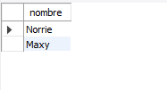
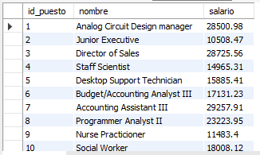
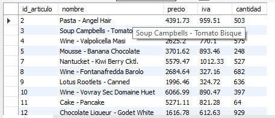
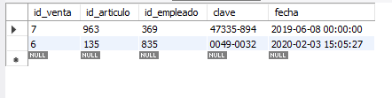

# Resultados de consultas

### Consulta 1: ¿Cuál es el nombre de los empleados con el puesto 4?

### Consulta 2: ¿Qué puestos tienen un salario mayor a $10,000?

### Consulta 3: ¿Qué articulos tienen un precio mayor a $1,000 y un iva mayor a 100?

### Consulta 4: ¿Qué ventas incluyen los artículo 135 o 963 y fueron hechas por los empleados 835 o 369?
