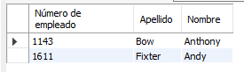
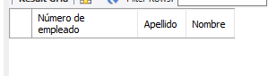
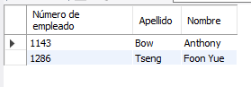
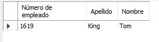
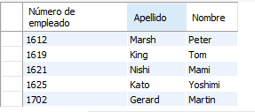

# Resultados de consultas

### Dentro de la tabla employees, obten el número de empleado, apellido y nombre de todos los empleados cuyo nombre empiece con a.

### Dentro de la tabla employees, obten el número de empleado, apellido y nombre de todos los empleados cuyo nombre termina con on.

### Dentro de la tabla employees, obten el número de empleado, apellido y nombre de todos los empleados cuyo nombre incluye la cadena on

### Dentro de la tabla employees, obten el número de empleado, apellido y nombre de todos los empleados cuyos nombres tienen tres letras e inician con T y finalizan con m.

### Dentro de la tabla employees, obten el número de empleado, apellido y nombre de todos los empleados cuyo nombre no inicia con B.

### 

### 

### 

### 

### 

### 

### 

### 

### 
