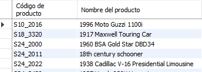
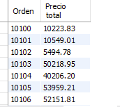
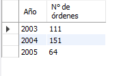
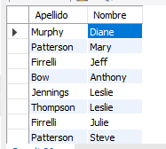
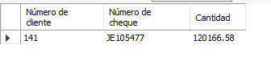
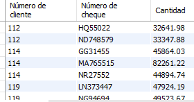
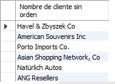
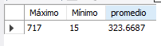
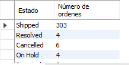

# Resultados de consultas

### Dentro de la tabla employees, obten el número de empleado, apellido y nombre de todos los empleados cuyo nombre empiece con a.

### Dentro de la tabla employees, obten el número de empleado, apellido y nombre de todos los empleados cuyo nombre termina con on.

### Dentro de la tabla employees, obten el número de empleado, apellido y nombre de todos los empleados cuyo nombre incluye la cadena on

### Dentro de la tabla employees, obten el número de empleado, apellido y nombre de todos los empleados cuyos nombres tienen tres letras e inician con T y finalizan con m.

### Dentro de la tabla employees, obten el número de empleado, apellido y nombre de todos los empleados cuyo nombre no inicia con B.

### Dentro de la tabla products, obten el código de producto y nombre de los productos cuyo código incluye la cadena _20.

### Dentro de la tabla orderdetails, obten el total de cada orden.

### Dentro de la tabla orders obten el número de órdenes por año.

### Obten el apellido y nombre de los empleados cuya oficina está ubicada en USA.

### Obten el número de cliente, número de cheque y cantidad del cliente que ha realizado el pago más alto.

### Obten el número de cliente, número de cheque y cantidad de aquellos clientes cuyo pago es más alto que el promedio.

### Obten el nombre de aquellos clientes que no han hecho ninguna orden.

### Obten el máximo, mínimo y promedio del número de productos en las órdenes de venta.

### Dentro de la tabla orders, obten el número de órdenes que hay por cada estado.

