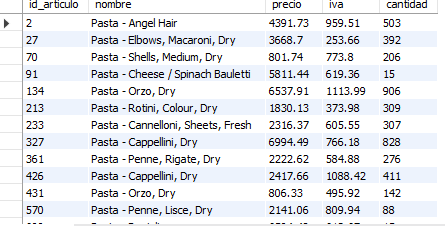
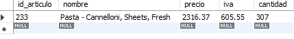
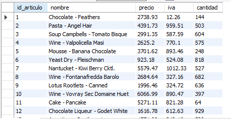
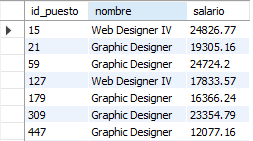
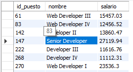

# Resultados de consultas

### Consulta 1: ¿Qué artículos incluyen la palabra Pasta en su nombre?

### Consulta 2: ¿Qué artículos incluyen la palabra Cannelloni en su nombre?

### Consulta 3: ¿Qué nombres están separados por un guión (-) por ejemplo Puree - Kiwi?

### Consulta 4: ¿Qué puestos incluyen la palabra Designer?

### Consulta 4: ¿Qué puestos incluyen la palabra Developer?
