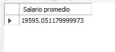
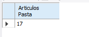
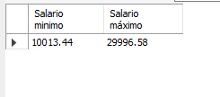
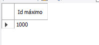
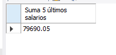

# Resultados de consultas

### Consulta 1: ¿Cuál es el promedio de salario de los puestos?

### Consulta 2: ¿Cuántos artículos incluyen la palabra Pasta en su nombre?

### Consulta 3: ¿Cuál es el salario mínimo y máximo?

### Consulta 4: ¿Cuál es la suma del salario de los últimos cinco puestos agregados?

