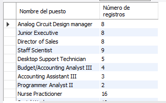
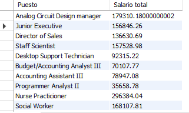
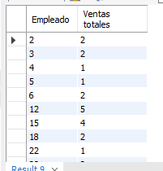

# Resultados de consultas

### Consulta 1: ¿Cuántos registros hay por cada uno de los puestos?

### Consulta 2: ¿Cuánto dinero se paga en total por puesto?

### Consulta 3: ¿Cuál es el número total de ventas por vendedor?

### Consulta 4: ¿Cuál es el número total de ventas por artículo?
