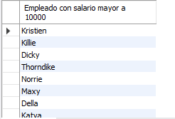
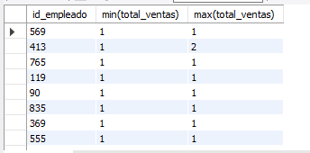
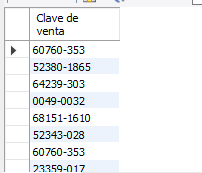

# Resultados de consultas

### Consulta 1: ¿Cuál es el nombre de los empleados cuyo sueldo es menor a $10,000?

### Consulta 2: ¿Cuál es la cantidad mínima y máxima de ventas de cada empleado?

### Consulta 3: ¿Cuáles claves de venta incluyen artículos cuyos precios son mayores a $5,000?
