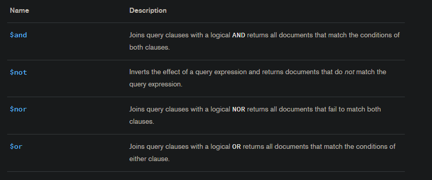
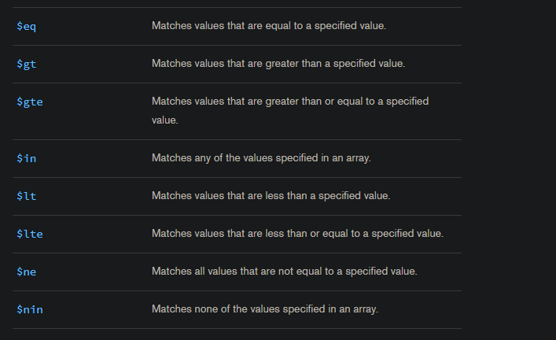
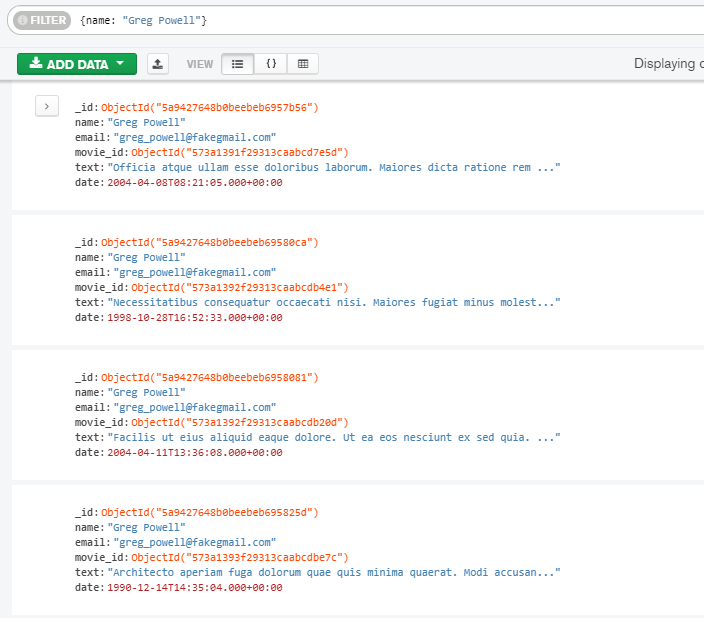
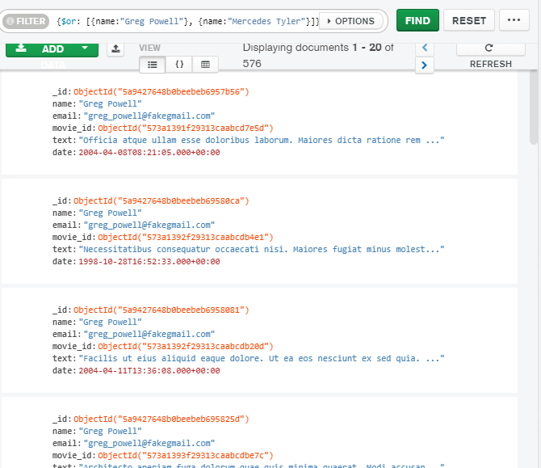
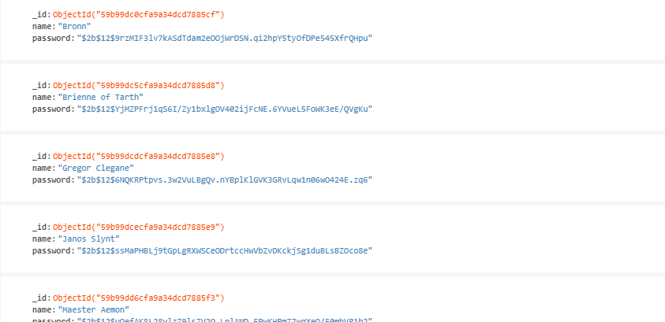

# Operadores lógicos MongoDB

# Operadores de comparación MongoDB

# Resultados de consultas

### Fecha, nombre y texto de cada comentario.

### Título, elenco y año de cada película.

### Nombre y contraseña de cada usuario.
